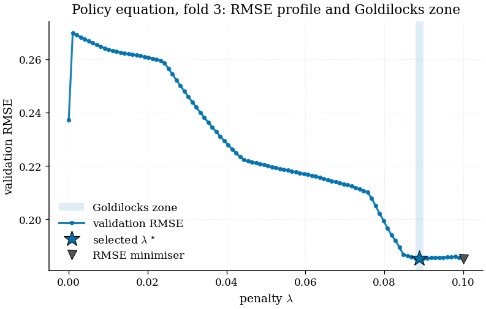
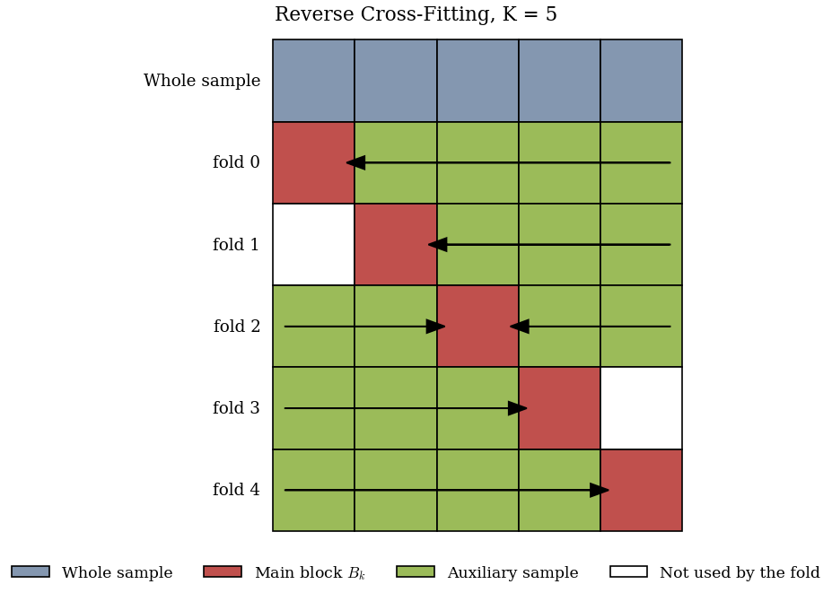

# tsdml — Double Machine Learning for Time Series

[](https://pypi.org/project/tsdml/)
[](https://pypi.org/project/tsdml/)
[](LICENSE)

A complete, faithful Python implementation of

> Ciganovic, M., D'Amario, F. and Tancioni, M. (2026).
> **Double Machine Learning for Time Series.** *The Econometrics Journal.*
> [arXiv:2603.10999](https://arxiv.org/abs/2603.10999)

Standard Double Machine Learning (Chernozhukov et al., 2018) needs *randomised*
cross-fitting, which shreds the sequential structure of a time series. The
existing fix — Neighbors-Left-Out cross-fitting — deletes buffer blocks around
each fold, which is expensive when you only have 60 quarters of data.

`tsdml` implements the paper's two answers:

| | What it does | Why it matters |
|---|---|---|
| **Reverse Cross-Fitting** | Trains nuisances on *time-reversed* auxiliary blocks and deletes **no buffer** | Uses 67% of the sample at `K=6` where NLO uses 56% |
| **Goldilocks-zone tuning** | Picks the penalty inside a locally *stable* region of the validation-error profile, not at its global minimum | Predictive tuning over-shrinks the policy equation; this cuts small-sample bias by ~24% |

Plus everything around them: DML local projections for impulse responses, HAC
inference with five bandwidth rules and fixed-*b* critical values, the
conditional-stability diagnostic, and journal-ready figures and LaTeX tables.

**Every number in this package has been verified bit-for-bit against the
authors' own replication code**, from data preparation through to the scaled
impulse responses of Figure 2. See [Fidelity](#fidelity).

---

## Contents

- [Install](#install)
- [60-second example](#60-second-example)
- [The method in five minutes](#the-method-in-five-minutes)
- [Step-by-step guide](#step-by-step-guide)
- [Working with your own data](#working-with-your-own-data)
- [Local projections](#local-projections)
- [Figures](#figures)
- [Tables](#tables)
- [Diagnostics: do not skip this](#diagnostics-do-not-skip-this)
- [Choosing K](#choosing-k)
- [HAC inference](#hac-inference)
- [The bundled dataset](#the-bundled-dataset)
- [API reference](#api-reference)
- [Fidelity](#fidelity)
- [Known limits](#known-limits)
- [Citation](#citation)

---

## Install

```bash
pip install tsdml
```

From source:

```bash
git clone https://github.com/merwanroudane/tsdml.git
cd tsdml
pip install -e ".[dev]"
pytest
```

Requires Python ≥ 3.9. Dependencies (`numpy`, `pandas`, `scipy`,
`scikit-learn`, `statsmodels`, `matplotlib`, `joblib`) all install
automatically — there is nothing to compile and no R or Stata involved.

Check it works:

```bash
python -c "import tsdml; print(tsdml.__version__); print(tsdml.sample_use_table([6,11,12]))"
```

---

## 60-second example

```python
import numpy as np
from sklearn.linear_model import Lasso
from tsdml import Calibrator, ReverseCrossFitting, simulate_plr

sim = simulate_plr(T=200, p=100, theta=1.5, seed=0)
X, y, d = sim["X"], sim["y"], sim["d"]           # time-ordered!

grid = {"alpha": np.linspace(1e-6, 0.4, 100), "max_iter": [100_000]}

cal = Calibrator(metric="goldilocks_zone", n_blocks=6)
cal.calibrate(X, y, d,
              outcome_learner_class=Lasso,    outcome_param_grid=grid,
              treatment_learner_class=Lasso,  treatment_param_grid=grid)

model = ReverseCrossFitting(
    n_blocks=6,
    block_specific_learners=cal.block_specific_learners_,
).fit(X, y, d)

model.summary()
```

```
========================================================================
Reverse Cross-Fitting DML  --  partially linear model
========================================================================
observations         : 200
folds (K)            : 6   block size 33
stage-2 method       : block
HAC                  : bartlett (rule 'small')
------------------------------------------------------------------------
                    coef     std err         t     P>|t|
theta           1.367399    0.083104    16.450    0.0000 ***
95% CI: [1.204518, 1.530280]
fold estimates: [1.0824, 1.0374, 1.6421, 1.4585, 1.3540, 1.6300]
========================================================================
```

---

## The method in five minutes

### The model

A partially linear model with a scalar policy variable and possibly many
controls (paper, eqs. 1.1–1.2):

```
y_t = θ₀ d_t + g₀(X_t) + ε_t ,      E[ε_t | X_t, d_t] = 0
d_t =        m₀(X_t) + ξ_t ,        E[ξ_t | X_t]      = 0
```

θ₀ is what you want. `g₀` and `m₀` are nuisances you must estimate well enough
that their error does not contaminate θ̂ — that is what orthogonalisation plus
cross-fitting buys you.

### Reverse Cross-Fitting

Cut the sample into `K` adjacent blocks `B₁ … B_K`. For fold `k`:

```
    ┌───────┬───────┬───────┬───────┬───────┐
k=0 │ MAIN  │  aux  │  aux  │  aux  │  aux  │  ← train right, read time BACKWARDS
    ├───────┼───────┼───────┼───────┼───────┤
k=1 │   ·   │ MAIN  │  aux  │  aux  │  aux  │  ← train right, backwards
    ├───────┼───────┼───────┼───────┼───────┤
k=2 │  aux  │  aux  │ MAIN  │  aux  │  aux  │  ← both sides, average (odd K only)
    ├───────┼───────┼───────┼───────┼───────┤
k=3 │  aux  │  aux  │  aux  │ MAIN  │   ·   │  ← train left, forward
    ├───────┼───────┼───────┼───────┼───────┤
k=4 │  aux  │  aux  │  aux  │  aux  │ MAIN  │  ← train left, forward
    └───────┴───────┴───────┴───────┴───────┘
```

Two things are doing work here.

**Time reversibility.** Stationary Gaussian processes have the same
finite-dimensional distributions read forwards or backwards, so a nuisance
fitted on the *reversed* right-hand blocks targets the same population function
as one fitted forwards. That licences using the future as training data for the
past.

**No buffer.** Unlike NLO, nothing is deleted between the auxiliary and main
samples. Validity comes instead from **conditional stability** (Assumption 2.4):

```
E[ξ_t | X_t, F_aux,k] = 0        and        E[ε_t | X_t, F_aux,k] = 0
```

After conditioning on `X_t`, the adjacent training blocks must carry no
information about the main-block innovations. Reversibility does *not* imply
this, and it does not imply reversibility — they are separate requirements.
`tsdml` gives you a test for it (see [Diagnostics](#diagnostics-do-not-skip-this)).

Estimation is then residual-on-residual OLS within each main block, averaged
across folds (eq. 2.5), with HAC inference built from the *stacked, time-ordered*
score sequence so that dependence across block boundaries is picked up.

### The Goldilocks zone

The penalty that minimises prediction error is not the penalty that minimises
bias in the causal score. Over-shrink the policy equation and you attenuate the
partialled-out signal; under-shrink and you absorb policy variation into the
controls. The paper's rule targets a *locally stable* region instead:

```
For each window W_j of S consecutive grid points:
    R̄_j = mean RMSE in the window          (level)
    V_j  = variance of RMSE in the window   (stability)
    S_j  = normalise(V_j) + normalise(R̄_j)

j* = argmin S_j                             pick the most stable good window
λ* = argmin RMSE within W_j*                then the best point inside it
```

Default `S = 3`. `plot_goldilocks_profile` shows you the picture:



The star is λ\*; the grey triangle is the plain RMSE minimiser. When they
diverge, the rule is doing something.

---

## Step-by-step guide

**A complete, annotated walkthrough — from a raw CSV to a submitted figure — is
in [`docs/STEP_BY_STEP_GUIDE.md`](docs/STEP_BY_STEP_GUIDE.md).** It writes the
code with you, line by line, and explains the choice behind each argument.

Runnable scripts:

| Script | What it does | Runtime |
|---|---|---|
| [`examples/01_quickstart.py`](examples/01_quickstart.py) | The five-step workflow on simulated data, plus the conditional-stability check firing and not firing | ~30 s |
| [`examples/02_empirical_replication.py`](examples/02_empirical_replication.py) | The paper's full Section 5 application: five outcomes, Figure 2, LaTeX tables | ~2 min |
| [`examples/03_tuning_and_design_comparison.py`](examples/03_tuning_and_design_comparison.py) | Monte Carlo: Goldilocks vs RMSE, RCF vs NLO | ~3 min |

---

## Working with your own data

`tsdml` accepts plain arrays, so you can bypass the data layer entirely:

```python
model = ReverseCrossFitting(outcome_learner, treatment_learner, n_blocks=6)
model.fit(X, y, d)     # X (T, p), y (T,), d (T,) -- rows in calendar order
```

**The only hard requirement: rows must be consecutive time periods in order.**
The block structure is positional. Shuffle the rows and the estimator is
meaningless — it will not warn you, because it cannot tell.

If you want the paper's data pipeline (transformations, fast/slow timing, lags,
leads, fold-divisible truncation), use `DataProcessor`. It expects a wide table
with two metadata rows on top:

| `sasdate` | `GDP` | `Spread` | `Yield10y` |
|---|---|---|---|
| **speed** | slow | slow | fast |
| **Transform:** | 5 | 2 | 2 |
| 2005-06-30 | 107.51 | 1.25 | 3.44 |
| 2005-09-30 | 108.09 | 1.28 | 3.51 |

- **`speed`** implements the block-recursive timing assumption of Section 5.2.
  `fast` variables (prices, yields, spreads, FX) enter the control set
  **contemporaneously** — they plausibly reflect within-quarter information.
  `slow` variables (GDP, employment, bank balance sheets) enter **only with
  lags**, which keeps you from conditioning on post-treatment mediators sitting
  on the transmission path.
- **`Transform:`** is the stationarity transformation, FRED-MD convention:

| Code | Transformation | | Code | Transformation |
|---|---|---|---|---|
| 1 | level | | 8 | log Δ₁₂ (monthly YoY) |
| 2 | first difference | | 81 | log Δ₄ (quarterly YoY) |
| 3 | second difference | | 9 | series ÷ HP trend |
| 4 | log | | 10 / 101 | Δ₁₂ / Δ₄ |
| 5 | **100 × Δlog** | | 11 / 111 | 100 × YoY growth |
| 6 | Δ²log | | 7 | 100 × growth rate |

  Codes 5, 7, 11 and 111 are multiplied by 100, so a log-differenced response
  reads directly as a percentage change. `tsdml.TRANSFORM_CODES` lists them all.

```python
from tsdml import DataProcessor

proc = DataProcessor()
X, y, d, leads = proc.data_prep(
    df=my_table,
    num_lags=3,                        # lags of every series, incl. y and d
    H=8,                               # horizons 0..8
    treatment_var="Policy rate", treatment_code=2,
    outcome_var="GDP",          outcome_code=5,
    start_date="2005-12-31",
    scaling_method="none",             # 'l2' | 'standard' | 'robust' | 'minmax'
    include_constant=True,
    K=6,                               # truncates so len(X) % K == 0
)
```

`treatment_code` and `outcome_code` must **match the sheet's `Transform:` row**
for those columns — they identify the transformed column, they do not override
it. You get a clear `KeyError` if they disagree.

Afterwards, `proc.original_index` holds the dates of the retained rows and
`proc.feature_names_` the column names of `X`.

---

## Local projections

Dynamic responses come from `DMLLocalProjections`, which residualises at every
horizon `h = 0 … H` and reuses the policy residuals across horizons (they do not
change, so stage one runs roughly half as often).

```python
from tsdml import DMLLocalProjections

lp = DMLLocalProjections(
    block_specific_learners=cal.block_specific_learners_,
    n_blocks=6,
    outcome_code=5,          # <- drives cumulation, see below
    outcome_name="GDP",
)
lp.fit(X, y, d, leads, index=proc.original_index)

lp.summary()
irf = lp.to_frame()          # Horizon, Coefficient, Std_Error, CI_*_90, CI_*_95
```

**`outcome_code` matters.** For an outcome in differences, the level response is
the *cumulative* sum of the horizon-by-horizon effects. Passing the
transformation code makes `tsdml` do that for you, following eq. (5.18):
codes 2/3/5/7/9 cumulate, 8/10 cumulate and divide by 12, 81/101 cumulate and
divide by 4, `None` or 1 leaves the response uncumulated. Get this wrong and
your impulse response is a growth-rate path when you meant a level path.

To normalise several responses to a common shock:

```python
from tsdml import scale_irfs

scaled = scale_irfs(
    {"Tier 1 capital": irf1, "Risk-weighted assets": irf2, "GDP": irf3, ...},
    numerator_var="Tier 1 capital",
    denominator_var="Risk-weighted assets",
    basis_point_vars=("Spread",),      # these get an extra ×100
    target_shock=0.5,                  # 50 basis points
)
```

Since the capital *ratio* is capital over risk-weighted assets, its impact
response is the difference of the two component responses; the scaling factor is
`target / (θ̂₀ᶜᵃᵖ − θ̂₀ᴿᵂᴬ)`.

---

## Figures

Every plotting function applies a journal style (serif, no top/right spine,
colourblind-safe Wong palette, editable PDF text) and returns the
`matplotlib.Figure` so you can keep editing.

```python
from tsdml import plot_irf_panel

plot_irf_panel(
    scaled,
    order=["Tier 1 capital", "Risk-weighted assets", "PNFC_Spread",
           "PNFC_Lending_K2020", "GDP_K2020"],
    titles={"GDP_K2020": "GDP", ...},
    ylabels={"PNFC_Spread": "Basis points", ...},
    layout=(2, 3),
    highlight="GDP_K2020",
    save_path="figure2.pdf",
)
```


A ragged last row is centred at full panel width rather than stretched — pass
`equal_widths=False` for the stretched alternative.

| Function | Figure |
|---|---|
| `plot_irf` | one impulse response with nested 90/95% bands |
| `plot_irf_panel` | the multi-panel Figure 2 layout |
| `plot_irf_comparison` | several responses overlaid (Goldilocks vs RMSE, RCF vs NLO) |
| `plot_block_structure` | the fold diagram, Figure 1 |
| `plot_goldilocks_profile` | the RMSE profile, the selected window and λ\* |
| `plot_sample_use` | RCF vs NLO sample use across `K` |
| `plot_residuals` | stage-one residuals with fold boundaries marked |



For slides: `use_journal_style(serif=False, base_fontsize=13)`.

---

## Tables

```python
from tsdml import irf_table, estimation_table, calibration_table, to_latex

to_latex(
    irf_table(scaled["GDP_K2020"], digits=3),
    caption="Cumulative response of GDP to a 50bp rise in the Tier 1 ratio",
    label="tab:gdp",
    notes="RCF-DML local projections, Goldilocks-tuned Lasso, $K=6$. "
          "Newey-West standard errors in parentheses. "
          "*** $p<0.01$, ** $p<0.05$, * $p<0.10$.",
    save_path="table_gdp.tex",
)
```

Output is `booktabs` (needs `\usepackage{booktabs}`), with standard errors in
parentheses beneath each estimate and the usual significance stars.
`to_markdown` is there for READMEs and issue threads.

`estimation_table` puts several specifications side by side:

```
             RCF (Goldilocks)        RCF (RMSE)          NLO
theta               1.3674***         1.3641***    1.2988***
Std. error           (0.0831)          (0.0834)     (0.0952)
t-statistic            16.450            16.364       13.643
p-value                0.0000            0.0000       0.0000
95% CI       [1.2045, 1.5303]  [1.2007, 1.5275]  [1.112, 1.485]
Folds K                     6                 6            6
Sample use              0.667             0.667        0.556
```

---

## Diagnostics: do not skip this

RCF buys its sample-use advantage by *not* deleting buffer blocks. The price is
that conditional stability has to hold. It is an assumption about your data, not
a property of the estimator, and it can fail — through residual serial
dependence after conditioning, omitted persistent states, asymmetric volatility,
or contemporaneously endogenous regimes.

```python
from tsdml import diagnose

checks = diagnose(model)
print(checks["leakage_policy"])       # per fold and pooled
print(checks["ljungbox_outcome"])
```

`boundary_leakage_test` regresses main-block residuals on leads and lags drawn
from the *adjacent* blocks — precisely the observations a buffered design would
have thrown away — and joint-tests those coefficients. A small p-value says the
neighbours still predict the residuals.

It behaves as advertised. On `simulate_plr` with white-noise disturbances
(conditional stability holds) it rejects 0 times in 40 draws; give the
disturbances their own AR(1) dynamics (`resid_persistence=0.7`) and it rejects
29 times in 40, while coverage falls from 85% to 75%.

**When it fires**, in the order the paper suggests:

1. **Enrich `X_t`** — more lags, factor proxies, regime indicators — so the
   conditioning set absorbs the predictable component. This is the preferred fix
   when the problem is an omitted persistent state.
2. **Switch to `NLOCrossFitting`** if the leakage is short-memory and will not
   go away. You buy independence and pay in sample use.

These are screening tools implementing a diagnostic the paper describes in
words; they are not a line-by-line port of its supplementary appendix, and a
rejection is a reason to think, not a formal test of Theorem 2.1.

---

## Choosing K

`K` trades main-block size against auxiliary-sample size. The asymptotics hold
`K` fixed, so this is a finite-sample judgement.

```python
from tsdml import sample_use_table
print(sample_use_table(range(3, 16)))
```

```
  K   u_RCF   u_NLO Winner
  3  0.6667  0.2222    RCF
  6  0.6667  0.5556    RCF
  9  0.7407  0.6914    RCF
 10  0.7000  0.7200    NLO
 11  0.7438  0.7438    tie
 12  0.7083  0.7639    NLO
```

RCF uses more of the sample than NLO for `K = 3…9`, they tie at `K = 11`, and
NLO wins at `K = 10` and from `K = 12` — so RCF is *not* uniformly better, it is
attractive in the moderate-`K` range where short macro samples live. The paper's
application uses **`K = 6`**, which gives a main-to-auxiliary ratio in line with
standard practice. Start there.

Two practical constraints: `T // K` must leave enough observations for a
stage-two regression in each block, and the `Calibrator` carves a validation
block of that same length out of the auxiliary sample, so very large `K` on a
short sample will raise a clear error rather than silently misbehave.

---

## HAC inference

Theorem 2.1 needs a HAC estimate of the long-run variance of the *stacked*
score sequence — not an average of fold-wise variances. That is what
`tsdml` computes.

```python
ReverseCrossFitting(
    ..., 
    hac_kernel="bartlett",              # 'bartlett' | 'qs' | 'parzen' | 'ewc'
    hac_bandwidth_rule="small",         # see below
    use_fixed_b_critical=False,
)
```

| Rule | Bandwidth | Source |
|---|---|---|
| `'small'` *(default)* | `min(h+1, 24)` | the paper's benchmark |
| `'newey-west'` | `⌊4(T/100)^(2/9)⌋` | Newey & West (1994) |
| `'andrews'` | AR(1) plug-in | Andrews (1991) |
| `'pow14'` / `'pow15'` | `⌊T^(1/4)⌋` / `⌊1.3221 T^(1/5)⌋` | rules of thumb |
| `'lls_nw'` | `⌈1.3 √T⌉` | Lazarus, Lewis, Stock & Watson (2018) |
| `'lls_ewc'` | `⌊0.4 T^(2/3)⌋` cosine terms | LLSW (2018), EWC |
| `'fixed'` | `hac_bandwidth_value` | yours |

`use_fixed_b_critical=True` switches to Kiefer–Vogelsang (2005) critical values
for Bartlett, or the exact Student-*t* fixed-*b* distribution for EWC. Pair it
with `'lls_nw'` or `'lls_ewc'` as LLSW recommend.

**A caveat worth knowing.** The default `min(h+1, 24)` is deliberately short.
When the cross-fitted score is strongly serially correlated it can produce
intervals that are too narrow — in a stress design with AR(0.8) disturbances,
observed coverage fell to about 75%. If your residual diagnostics show
persistence, move to `'lls_nw'` with `use_fixed_b_critical=True`. The point
estimate is unaffected; only inference changes.

---

## The bundled dataset

```python
from tsdml import load_macroprudential, macroprudential_spec

df   = load_macroprudential()      # 37 series, 2005Q2-2024Q4, metadata rows on top
spec = macroprudential_spec()      # the paper's exact Section 5 specification
```

Quarterly Italian macro-financial and banking data assembled from official
sources (IMF Financial Soundness Indicators, ISTAT, Bank of Italy, ECB and
market data). The policy variable is the **Tier 1 capital-to-risk-weighted-assets
ratio**; outcomes are Tier 1 capital, risk-weighted assets, the PNFC lending
spread, PNFC lending and GDP.

`macroprudential_spec()` returns the treatment, outcomes and their codes, the
six variables dropped to avoid mechanical collinearity with the policy ratio,
`num_lags=3`, `H=8`, `n_blocks=6`, the start date, and plotting labels.

See [`src/tsdml/data/SOURCES.md`](src/tsdml/data/SOURCES.md) for provenance and
redistribution notes.

---

## API reference

**Estimators**

```python
ReverseCrossFitting(outcome_learner, treatment_learner, n_blocks=5, ...)
    .fit(X, y, treatment, verbose=False) -> self
    .theta_, .results_, .residuals_, .blocks_
    .summary(), .to_frame(), .block_frame(), .plot_structure()

NLOCrossFitting(...)          # same interface, buffered design, K >= 4

DMLLocalProjections(..., outcome_code=None, n_blocks=6)
    .fit(X, y, treatment, leads, index=None) -> self
    .irf_, .results_, .estimators_
    .summary(), .to_frame(), .residuals_frame(), .plot(), .save(path)
```

**Tuning**

```python
Calibrator(metric='goldilocks_zone', n_blocks=5, stability_window_size=3, n_jobs=1)
    .calibrate(X, y, treatment, outcome_learner_class=..., outcome_param_grid=..., ...)
    .block_specific_learners_, .rmse_profiles_, .calibration_scores_
    .summary(), .selected_params_frame()

goldilocks_select(rmse_profile, window_size=3) -> int
```

**Folds and inference**

```python
reverse_cf_folds(n, K) -> BlockStructure
nlo_folds(n, K) -> (main, aux)
fold_direction(k, K) -> 'reverse' | 'both' | 'forward'
sample_use_rcf(K), sample_use_nlo(K)
hac_lrv(scores, K=0, kernel='bartlett', bandwidth=None)
compute_hac_bandwidth(rule, horizon=0, T=None, scores=None, value=None)
fixed_b_critical_value(kernel, b=None, nu=None, alpha=0.05)
fit_stage_two(chi, xi, estimation_method='block', ...)
```

**Data**

```python
DataProcessor().data_prep(...) -> (X, y, policy, leads)
transform_series(x, tcode);  TRANSFORM_CODES
load_macroprudential();  macroprudential_spec()
simulate_svar(n, T, theta, specification='misspecified'|'specified', ...)
simulate_plr(T, p, theta, rho, resid_persistence=0.0, ...)
```

**Diagnostics, figures, tables** — listed in their sections above.

Everything is documented with numpydoc docstrings and runnable examples:
`help(tsdml.ReverseCrossFitting)`.

---

## Fidelity

The package was written against the authors' replication package and checked
against it end to end on the paper's own data and specification:

| Checked | Result |
|---|---|
| `X`, `y`, `policy`, `leads` from `data_prep` | identical |
| Estimation index (dates, length 54) | identical |
| Stage-one residuals, both equations | identical |
| θ̂ and standard error, fixed-penalty RCF | identical to 1e-15 |
| Goldilocks-selected penalties, all 6 folds, both equations | identical |
| Impulse responses, all 5 outcomes, 9 horizons, 90% and 95% bands | identical |
| Scaled Figure 2 responses | identical |

Regression tests in [`tests/test_paper_replication.py`](tests/test_paper_replication.py)
pin these values so they cannot drift, including the published GDP path
(−0.036, −0.100, −0.144 at h = 0, 1, 2) and the qualitative findings of
Section 5.3.

Run them:

```bash
pytest -m "not slow"    # ~2 min
pytest                  # includes the full five-outcome replication
```

Design choices inherited deliberately from the replication code, because
changing them would change published numbers: the `n // K` truncation of a final
partial block; block-level stage-two regressions fitted without HAC before the
fold average; the `T − K` denominator in the autocovariance estimator; and the
horizon-specific `hac_lag = h + 1` in local projections.

---

## Known limits

- **Rows must be in calendar order.** Nothing checks this, and nothing can.
- **`T` not divisible by `K`** leaves trailing observations outside every main
  block; you get a warning and they are used for nuisance training only.
  `DataProcessor` truncates for you.
- **The default HAC bandwidth is short** — see the caveat above.
- **Conditional stability is an assumption about your data.** Test it.
- **`simulate_svar`'s default is the mis-specified stress design**, where the
  PLR estimand need not equal the structural impact coefficient. Use
  `specification='specified'` to measure bias against a known target.
- The simulation designs of the paper's supplementary appendix (SDFM,
  state-dependent SVAR, SVAR-GARCH) are **not** bundled; `simulate_svar` and
  `simulate_plr` cover the benchmark recursive SVAR and a transparent PLR.

---

## Citation

If you use this package, cite the paper:

```bibtex
@article{ciganovic2026dml,
  title   = {Double Machine Learning for Time Series},
  author  = {Ciganovic, Milos and D'Amario, Federico and Tancioni, Massimiliano},
  journal = {The Econometrics Journal},
  year    = {2026},
  note    = {arXiv:2603.10999}
}
```

and, if you wish, the software:

```bibtex
@software{roudane2026tsdml,
  title  = {tsdml: Double Machine Learning for Time Series in Python},
  author = {Roudane, Merwan},
  year   = {2026},
  url    = {https://github.com/merwanroudane/tsdml},
  version = {0.1.0}
}
```

---

## Author

**Dr Merwan Roudane**
📧 [merwanroudane920@gmail.com](mailto:merwanroudane920@gmail.com)
🔗 [github.com/merwanroudane](https://github.com/merwanroudane)

Also on CRAN: `QuantileOnQuantile`, `mqqr`, `qqkrls`, `mqqcause`.

Issues and pull requests welcome at
[github.com/merwanroudane/tsdml/issues](https://github.com/merwanroudane/tsdml/issues).

## License

MIT — see [LICENSE](LICENSE). The method is the authors' of the paper; this is
an independent open-source implementation.
