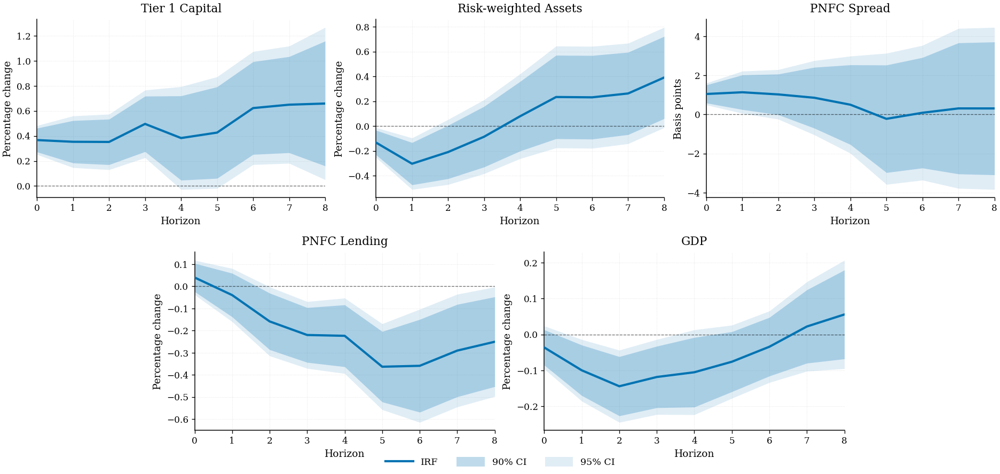

# tsdml — step-by-step code guide

This guide writes the code with you. Each step shows the lines to type, what
they produce, and — the part that actually matters — *why* each argument is set
the way it is and what breaks if you set it differently.

Work through it in a notebook or a script. Every block runs on its own once the
earlier ones have.

**Contents**

- [Step 0 — Install and verify](#step-0--install-and-verify)
- [Step 1 — Decide what you are estimating](#step-1--decide-what-you-are-estimating)
- [Step 2 — Shape your data](#step-2--shape-your-data)
- [Step 3 — Choose K](#step-3--choose-k)
- [Step 4 — Choose the learners](#step-4--choose-the-learners)
- [Step 5 — Tune the nuisances](#step-5--tune-the-nuisances)
- [Step 6 — Estimate](#step-6--estimate)
- [Step 7 — Test the assumption you are relying on](#step-7--test-the-assumption-you-are-relying-on)
- [Step 8 — Dynamic effects](#step-8--dynamic-effects)
- [Step 9 — Normalise the shock](#step-9--normalise-the-shock)
- [Step 10 — Figures](#step-10--figures)
- [Step 11 — Tables](#step-11--tables)
- [Step 12 — Robustness](#step-12--robustness)
- [Step 13 — The complete script](#step-13--the-complete-script)
- [Troubleshooting](#troubleshooting)

---

## Step 0 — Install and verify

```bash
pip install tsdml
```

```python
import tsdml
print(tsdml.__version__)
print(tsdml.CITATION)
```

You should see `0.1.0` and the paper reference. If the import fails, you are
probably in a different environment from the one `pip` wrote to — check
`python -c "import sys; print(sys.executable)"`.

---

## Step 1 — Decide what you are estimating

Before writing any estimation code, be able to fill in this sentence:

> *The effect of a one-unit change in **`d`** on **`y`**, holding fixed
> **`X`**, under the assumption that **`X`** contains everything that drives
> both.*

`tsdml` estimates θ₀ in the partially linear model

```
y_t = θ₀ d_t + g₀(X_t) + ε_t
d_t =        m₀(X_t) + ξ_t
```

Three things to settle now, because no amount of machine learning fixes them
later.

**1. `d` must be scalar.** One policy variable. If you have several, estimate
them one at a time and be explicit that each holds the others fixed only through
`X`.

**2. `X` must not contain post-treatment variables.** Conditioning on something
that `d` causes blocks the very channel you want to measure. This is why the
data layer distinguishes *fast* from *slow* variables — see Step 2.

**3. `X` must be rich enough** that ε and ξ are unpredictable given it. This is
the identifying assumption, and it is also — in time-series form — the
conditional stability condition RCF leans on. Step 7 tests it.

---

## Step 2 — Shape your data

### The hard requirement

```python
model.fit(X, y, d)
```

`X` is `(T, p)`, `y` and `d` are `(T,)`, and **row `t` must be period `t`, in
order**. The fold structure is positional: block 0 is the first `T//K` rows,
block 1 the next, and so on. Sort your frame by date once, at the top of the
script, and never reorder it again.

```python
df = df.sort_index()           # do this once and stop worrying
```

Nothing checks this for you. A shuffled `X` produces a number, and the number is
meaningless.

### Option A — arrays you built yourself

If you already have a stationary design matrix, you are done. Skip to Step 3.

```python
import numpy as np
X = np.column_stack([...])     # (T, p), time-ordered
y = ...                        # (T,)
d = ...                        # (T,)
```

### Option B — the paper's pipeline

`DataProcessor` does transformations, timing, lags, leads and fold-divisible
truncation. It wants a wide table with two metadata rows:

```python
import pandas as pd

df = pd.read_csv("mydata.csv")
df.index = df.iloc[:, 0]       # first column holds 'speed', 'Transform:', dates
df = df.iloc[:, 1:]
print(df.head(3))
```

```
              GDP  Spread  Yield10y
speed        slow    slow      fast
Transform:      5       2         2
2005-06-30 107.51    1.25      3.44
```

**The `speed` row** encodes the timing assumption of Section 5.2:

- `fast` — prices, yields, spreads, exchange rates. Plausibly observed within
  the period, so they enter `X` **contemporaneously**.
- `slow` — GDP, employment, bank balance sheets. Enter **only with lags**.

That asymmetry is your defence against conditioning on mediators. When in doubt,
mark a variable `slow`: you lose a little information and keep the
interpretation.

**The `Transform:` row** makes each series stationary:

| Code | Transformation | Typical use |
|---|---|---|
| 1 | level | already stationary |
| 2 | first difference | rates, ratios, spreads |
| 4 | log | — |
| 5 | **100 × Δlog** | GDP, credit, prices → percent |
| 6 | Δ²log | strongly trending stocks |
| 7 | 100 × growth rate | percent alternative to 5 |
| 8 / 81 | log Δ₁₂ / log Δ₄ | year-on-year, monthly / quarterly |
| 9 | series ÷ HP trend | cyclical ratio |
| 10 / 101 | Δ₁₂ / Δ₄ | year-on-year differences |
| 11 / 111 | 100 × YoY growth | — |

Codes 5, 7, 11 and 111 carry a ×100, so a log-differenced response reads
directly as a percentage change. `print(tsdml.TRANSFORM_CODES)` lists them all.

Now build the arrays:

```python
from tsdml import DataProcessor

proc = DataProcessor()
X, y, d, leads = proc.data_prep(
    df=df,
    num_lags=3,                    # lags of EVERY series, including y and d
    H=8,                           # horizons 0..8 -> leads has 9 columns
    treatment_var="Policy rate", treatment_code=2,
    outcome_var="GDP",          outcome_code=5,
    start_date="2005-12-31",
    end_date=None,
    scaling_method="none",
    scale_outcome_treatment=False,
    include_constant=True,
    K=6,
)

print(X.shape, y.shape, d.shape, leads.shape)
print(proc.original_index[0], "to", proc.original_index[-1])
```

Argument by argument:

| Argument | Why this value |
|---|---|
| `num_lags=3` | Three lags of every series. This is what makes ε and ξ innovations rather than forecastable residuals — the single most effective lever on conditional stability. Too few and Step 7 will tell you. |
| `H=8` | Eight quarters. `leads[:, h]` is `y_{t+h}`; column 0 equals `y`. |
| `treatment_code`, `outcome_code` | **Must match the sheet's `Transform:` row** for those columns. They identify the transformed column; they do not override it. Mismatched, you get a clear `KeyError`. |
| `start_date` | Applied *after* lags and leads, so you do not silently lose rows to the transformation warm-up. |
| `scaling_method="none"` | The paper's choice. Lasso is not scale-free, so `'standard'` is defensible — but then the coefficient is in standardised units unless `scale_outcome_treatment=False` (the default) keeps `y` and `d` raw. |
| `include_constant=True` | Adds a `cons` column to `X`. |
| `K=6` | Truncates the tail so `len(X) % K == 0` and every observation lands in a main block. |

Afterwards, `proc.original_index` holds the dates of the retained rows — pass it
to the local-projection fit so residuals carry dates — and `proc.feature_names_`
holds the column names of `X`.

Sanity check what actually went in contemporaneously:

```python
contemporaneous = [c for c in proc.feature_names_ if not c.startswith("lag")]
print(contemporaneous)
assert proc.names_["treatment"] not in contemporaneous     # d is not in X
```

---

## Step 3 — Choose K

`K` is the number of folds. Larger `K` means bigger auxiliary samples (better
nuisances) and smaller main blocks (noisier fold estimates).

```python
from tsdml import sample_use_table, plot_sample_use

print(sample_use_table(range(3, 16)))
plot_sample_use(range(3, 16), save_path="sample_use.pdf")
```

```
  K   u_RCF   u_NLO Winner
  3  0.6667  0.2222    RCF
  6  0.6667  0.5556    RCF
  9  0.7407  0.6914    RCF
 10  0.7000  0.7200    NLO
 11  0.7438  0.7438    tie
 12  0.7083  0.7639    NLO
```

RCF uses more of the sample than the buffered NLO design for `K = 3…9`, they tie
at 11, and NLO wins at 10 and from 12. RCF is not uniformly better — it is
attractive in the moderate-`K` range, which is where short macroeconomic samples
live.

**Use `K = 6` unless you have a reason not to.** That is the paper's choice in
the application, and it gives a main-to-auxiliary ratio consistent with standard
practice.

Two constraints to respect:

- `T // K` must leave enough observations for a regression in each main block.
- The `Calibrator` carves a validation block of that same length out of the
  auxiliary sample, so a large `K` on a short sample runs out of training data —
  you will get an explicit error, not a silent failure.

Look at the geometry once, so you know what the estimator is doing:

```python
from tsdml import plot_block_structure
plot_block_structure(K=6, save_path="folds.pdf")
```

---

## Step 4 — Choose the learners

Any scikit-learn regressor with `.fit` / `.predict` works. Two are needed: one
for `E[y | X]`, one for `E[d | X]`.

```python
from sklearn.linear_model import Lasso
```

**Start with Lasso.** The paper does, and the reason is not laziness: the
theory needs the nuisance error to shrink at `o_p(T^{-1/4})`, which penalised
linear learners attain over a *range* of penalties in approximately linear,
approximately sparse settings. That range is exactly what the Goldilocks rule
searches inside.

If you want something more flexible:

```python
from sklearn.ensemble import RandomForestRegressor
from sklearn.linear_model import ElasticNet, Ridge
```

Two cautions. First, tree ensembles in a `T = 60`, `p = 100` setting will
overfit the auxiliary block and you will feel it in the bias. Second, anything
with internal randomness needs `random_state` fixed, or your results will not
reproduce.

Define the search grid now:

```python
import numpy as np

grid = {
    "alpha": np.linspace(1e-6, 0.1, 100),    # ordered, fine, 100 points
    "max_iter": [100_000],
    "random_state": [42],
}
```

Three things about this grid.

**Order matters.** The Goldilocks rule is *local*: it slides a window along the
grid in the order you give it. `np.linspace` and `np.logspace` are both
monotone, which is what you want. A shuffled grid makes the "window" meaningless.

**Density matters.** A window of 3 points on a 100-point grid spans 3% of the
penalty range — genuinely local. On a 5-point grid it spans 60%, and the rule
degenerates towards picking the global minimum.

**Range matters.** If the selected `alpha` sits at the edge of your grid, the
grid is too narrow. Widen it and re-run:

```python
print([lrn.alpha for lrn in cal.best_treatment_learners_])   # after Step 5
```

Values pinned at `grid["alpha"][-1]` are a signal, not a result.

---

## Step 5 — Tune the nuisances

```python
from tsdml import Calibrator

cal = Calibrator(
    metric="goldilocks_zone",     # the paper's rule; 'rmse' for the standard one
    n_blocks=6,
    stability_window_size=3,      # S = 3, the paper's benchmark
    verbose=False,
    n_jobs=1,                     # -1 uses all cores
)

cal.calibrate(
    X, y, d,
    outcome_learner_class=Lasso,   outcome_param_grid=dict(grid),
    treatment_learner_class=Lasso, treatment_param_grid=dict(grid),
)

cal.summary()
print(cal.selected_params_frame().round(5))
```

```
fold   n_train  n_val    outcome RMSE    policy RMSE
0           36      9        1.482100       0.186540
1           27      9        1.361232       0.176618
...
```

### What just happened

For each fold `k`, the calibrator split the *auxiliary* sample in two: a
validation block of `|B_k|` observations **adjacent to the main block**, and
everything else for training. Candidates were fitted on the training part and
scored on the validation block. The main block was never touched — that is what
keeps tuning measurable with respect to the auxiliary σ-field and leaves the
proof of Theorem 2.1 intact.

Then, per fold and per equation, the Goldilocks rule ran over the RMSE profile:

```
R̄_j = mean RMSE in window j          V_j = variance of RMSE in window j
S_j = normalise(V_j) + normalise(R̄_j)
j*  = argmin S_j                      λ* = argmin RMSE inside window j*
```

See it:

```python
from tsdml import plot_goldilocks_profile

plot_goldilocks_profile(
    cal.rmse_profiles_[3]["treatment"],     # fold 3, policy equation
    grid=grid["alpha"],
    window_size=3,
    title="Policy equation, fold 3",
    save_path="goldilocks.pdf",
)
```

The shaded band is the selected window, the star is λ\*, and a grey triangle
marks the plain RMSE minimiser when the two differ.

### Why not just minimise RMSE

Because the two objectives are not the same one. Over-shrink the policy equation
and `d̂` explains too little, so the residual `ξ̂` keeps confounding variation;
under-shrink and the controls absorb policy variation that should have
identified θ. Section 3 shows the gap between prediction-optimal and
minimum-bias tuning *widens* as `p/T` rises. The stable region is a proxy for
the zone where neither failure dominates.

To see it on your own data, run both and compare:

```python
cal_rmse = Calibrator(metric="rmse", n_blocks=6)
cal_rmse.calibrate(X, y, d,
                   outcome_learner_class=Lasso,   outcome_param_grid=dict(grid),
                   treatment_learner_class=Lasso, treatment_param_grid=dict(grid))
```

### Speed

`n_jobs=-1` parallelises candidate evaluation. With 100 penalties × 6 folds × 2
equations = 1,200 fits, it is worth it. Keep the default
`backend='threading'` for scikit-learn estimators — the `'loky'` process backend
pays a pickling cost that usually swamps the gain here.

---

## Step 6 — Estimate

```python
from tsdml import ReverseCrossFitting

model = ReverseCrossFitting(
    n_blocks=6,
    block_specific_learners=cal.block_specific_learners_,
    estimation_method="block",     # fold-average, the paper's eq. (2.5)
    include_constant=True,
    use_hac=True,
    confidence_level=0.95,
    hac_kernel="bartlett",
    hac_bandwidth_rule="small",    # m = min(h+1, 24)
)

model.fit(X, y, d, verbose=True)
model.summary()
```

```
========================================================================
Reverse Cross-Fitting DML  --  partially linear model
========================================================================
observations         : 54
folds (K)            : 6   block size 9
stage-2 method       : block
HAC                  : bartlett (rule 'small')
------------------------------------------------------------------------
                    coef     std err         t     P>|t|
theta          -0.288059    0.532089     0.541    0.5903
95% CI: [-1.354594, 0.778477]
fold estimates: [-0.6841, 0.1275, -0.8290, 0.1367, -0.5762, 0.0968]
========================================================================
```

Note the estimator only takes the *hyperparameters* from the calibrator: inside
each fold it clones the selected learner and refits it on the full auxiliary
sample. That is the paper's `η̂^(k)(λ*)` step.

`estimation_method`:

- `"block"` — fit θ̂_k on each main block, average. The paper's default. The
  standard error is **not** an average of fold standard errors: it is built from
  the stacked, time-ordered score sequence, so dependence across block
  boundaries is captured.
- `"full"` — pool all residuals into one HAC regression. Useful as a check; the
  two should be close, and a large gap means fold heterogeneity worth
  investigating (look at `model.results_["block_coefs"]`).

Pull results out:

```python
model.theta_                       # float
model.results_                     # dict: coef, std_error, t_stat, p_value, ci_*
model.to_frame()                   # one-row DataFrame
model.block_frame()                # per-fold estimates
model.residuals_["outcome"]        # out-of-sample residuals, calendar order
model.residuals_["treatment"]
```

---

## Step 7 — Test the assumption you are relying on

**Do not skip this step.** RCF earns its sample-use advantage by *not* deleting
buffer blocks. In exchange it needs conditional stability:

```
E[ξ_t | X_t, F_aux,k] = 0
```

After conditioning on `X_t`, the adjacent training blocks must carry no
information about the main-block innovations. Time reversibility does not give
you this — they are separate requirements.

```python
from tsdml import diagnose

checks = diagnose(model, max_lag=2, lb_lags=8)

leak = checks["leakage_policy"]
print(leak[leak["fold"] == "pooled"])
print(checks["ljungbox_outcome"].head())
```

```
   fold   F_stat  p_value  n_obs  df
 pooled 0.286601  0.88529     22   4
```

`boundary_leakage_test` regresses main-block residuals on leads and lags drawn
from the *adjacent* blocks — exactly the observations a buffered design would
have discarded — and joint-tests those coefficients. A small p-value says the
neighbours still predict the residuals.

It behaves as advertised: on a design where the disturbances are white noise it
rejects 0 times in 40 draws; give them AR(0.7) dynamics and it rejects 29 times
in 40, while coverage drops from 85% to 75%.

Also look at the residuals directly:

```python
from tsdml import plot_residuals

plot_residuals(model.residuals_, index=proc.original_index, n_blocks=6,
               save_path="residuals.pdf")
```

Fold boundaries are marked. A visible level or variance shift at a boundary is a
warning even if the formal test passes.

### If it fires

In the order the paper suggests:

**1. Enrich `X_t`.** More lags first — go from 3 to 4 or 5 and re-run Steps 2–7.
Then factor proxies, regime indicators, whatever captures the persistent state
you are missing. This is the right fix when the problem is an omitted state,
because deleting neighbours would not have helped anyway.

**2. Switch to a buffered design.**

```python
from tsdml import NLOCrossFitting

nlo = NLOCrossFitting(
    n_blocks=6,
    block_specific_learners=cal.block_specific_learners_,
).fit(X, y, d)
nlo.summary()
```

You buy approximate independence and pay in sample use (55.6% vs 66.7% at
`K = 6`). Report both and say which you prefer and why.

---

## Step 8 — Dynamic effects

Impulse responses come from local projections at horizons `h = 0 … H`:

```
y_{t+h} = θ_h d_t + g_h(X_t) + ε_{t+h}
```

```python
from tsdml import DMLLocalProjections

lp = DMLLocalProjections(
    block_specific_learners=cal.block_specific_learners_,
    n_blocks=6,
    estimation_method="block",
    outcome_code=5,                 # <- read the note below
    confidence_level=0.95,
    outcome_name="GDP",
)

lp.fit(X, y, d, leads, verbose=True, index=proc.original_index)
lp.summary()

irf = lp.to_frame()
```

```
 h         coef     std err        t    P>|t|              [95% CI]
 0     -0.57293     0.44011    1.302   0.1990    [ -1.45911,  0.31325]
 1     -1.58444     0.85049    1.863   0.0684    [ -3.29650,  0.12762] *
 2     -2.28978     1.24583    1.838   0.0720    [ -4.79768,  0.21813] *
...
```

### `outcome_code` is the argument to get right

For an outcome in *differences*, the response of the **level** is the cumulative
sum of the horizon-by-horizon effects. Passing the transformation code makes
`tsdml` build that regressand for you, following eq. (5.18):

| `outcome_code` | Behaviour |
|---|---|
| `None` or `1` | no cumulation — the outcome is already a level |
| `2, 3, 5, 7, 9` | cumulate: `Σ_{j≤h} χ̂_{t+j}` |
| `8, 10` | cumulate, divide by 12 (monthly year-on-year) |
| `81, 101` | cumulate, divide by 4 (quarterly year-on-year) |
| `12` | cumulate, add the current horizon again, divide by 12 |

Pass the same code you gave `data_prep`. Get it wrong and you report a
growth-rate path where you meant a level path — the plot will look plausible and
be wrong.

### Why this is fast

`X` and `d` do not change across horizons; only `y_{t+h}` does. `tsdml` detects
that and reuses the policy residuals, so stage one runs about half as often as
the naive loop. You get it for free — nothing to configure.

### What you must assume

Causal reading of θ_h needs horizon-specific exogeneity (eq. 4.17):

```
E[ε_{t+h} | X_t, d_t] = 0        for every h
```

DML does not deliver this. It makes rich conditioning *feasible*, which makes
the assumption more plausible. It does not eliminate contemporaneous simultaneity,
omitted structural shocks, or anticipation effects. Say so in your paper.

---

## Step 9 — Normalise the shock

Raw local-projection coefficients are in the units of your transformed policy
variable. To report "the response to a 50 basis-point rise in the capital
ratio", normalise:

```python
from tsdml import scale_irfs

irfs = {name: lp_by_name[name].to_frame() for name in outcomes}

scaled = scale_irfs(
    irfs,
    numerator_var="Tier 1 capital",
    denominator_var="Risk-weighted assets",
    basis_point_vars=("PNFC_Spread",),
    target_shock=0.5,
)
```

The capital *ratio* is capital ÷ risk-weighted assets, so its impact response is
the difference of the two component responses, and the factor is

```
c = target_shock / (θ̂₀^capital − θ̂₀^RWA)
```

Variables in `basis_point_vars` get an extra ×100. Check it worked:

```python
impact = (scaled["Tier 1 capital"]["Coefficient"].iloc[0]
          - scaled["Risk-weighted assets"]["Coefficient"].iloc[0])
print(impact)          # 0.5
```

If your policy variable is a simple rate rather than a ratio, you do not need
this — just multiply every column by `target / θ̂₀` yourself, or leave the
responses unnormalised and say so.

---

## Step 10 — Figures

Single response:

```python
from tsdml import plot_irf

plot_irf(scaled["GDP_K2020"],
         title="GDP", ylabel="Percentage change",
         save_path="gdp.pdf")
```

Multi-panel, the paper's Figure 2:

```python
from tsdml import plot_irf_panel

plot_irf_panel(
    scaled,
    order=["Tier 1 capital", "Risk-weighted assets", "PNFC_Spread",
           "PNFC_Lending_K2020", "GDP_K2020"],
    titles={"Tier 1 capital": "Tier 1 Capital",
            "Risk-weighted assets": "Risk-weighted Assets",
            "PNFC_Spread": "PNFC Spread",
            "PNFC_Lending_K2020": "PNFC Lending",
            "GDP_K2020": "GDP"},
    ylabels={"PNFC_Spread": "Basis points"},   # others default to % change
    layout=(2, 3),
    highlight="GDP_K2020",
    save_path="figure2.pdf",
)
```



Comparisons:

```python
from tsdml import plot_irf_comparison

plot_irf_comparison(
    {"Goldilocks": irf_gz, "RMSE": irf_rmse},
    reference="Goldilocks",       # drawn solid; others dashed
    bands_for="Goldilocks",       # only one set of bands, or it is unreadable
    title="Tuning rule",
    save_path="comparison.pdf",
)
```

Style notes:

- **Save as `.pdf`** for submission — vector, and text stays editable
  (`pdf.fonttype = 42`).
- Every function returns the `Figure`, so you can keep adjusting:

  ```python
  fig = plot_irf(irf)
  fig.axes[0].set_ylim(-0.5, 0.5)
  fig.savefig("gdp.pdf", bbox_inches="tight")
  ```

- For slides: `use_journal_style(serif=False, base_fontsize=13)` before plotting.
- The palette is colourblind-safe (Wong 2011) and prints legibly in greyscale.

---

## Step 11 — Tables

```python
from tsdml import irf_table, to_latex

to_latex(
    irf_table(scaled["GDP_K2020"], digits=3, se_below=True, ci_level=95),
    caption="Cumulative response of GDP to a 50 basis-point rise in the "
            "Tier 1 capital ratio",
    label="tab:gdp",
    notes="RCF-DML local projections with Goldilocks-tuned Lasso nuisances, "
          "$K=6$ folds, three lags of all controls. Newey-West standard errors "
          "with bandwidth $m=\\min(h+1,24)$ in parentheses. "
          "*** $p<0.01$, ** $p<0.05$, * $p<0.10$.",
    save_path="table_gdp.tex",
)
```

Add `\usepackage{booktabs}` to your preamble and `\input{table_gdp.tex}`.

Specification comparison:

```python
from tsdml import estimation_table

print(estimation_table({
    "RCF (Goldilocks)": model,
    "RCF (RMSE)": model_rmse,
    "NLO": nlo,
}))
```

Calibration appendix:

```python
from tsdml import calibration_table
to_latex(calibration_table(cal), caption="Selected penalties by fold",
         label="tab:calib", save_path="table_calib.tex")
```

For a README or an issue thread, `to_markdown` instead of `to_latex`.

---

## Step 12 — Robustness

Referees will ask for these. Run them before they do.

**Number of folds.**

```python
for K in (4, 5, 6, 7, 8):
    c = Calibrator(metric="goldilocks_zone", n_blocks=K)
    c.calibrate(X, y, d,
                outcome_learner_class=Lasso,   outcome_param_grid=dict(grid),
                treatment_learner_class=Lasso, treatment_param_grid=dict(grid))
    m = ReverseCrossFitting(n_blocks=K,
                            block_specific_learners=c.block_specific_learners_
                            ).fit(X, y, d)
    print(f"K={K}: theta={m.theta_:+.4f}  se={m.results_['std_error']:.4f}")
```

**Goldilocks window size.**

```python
for S in (3, 4, 5):
    c = Calibrator(metric="goldilocks_zone", n_blocks=6, stability_window_size=S)
    ...
```

**HAC kernel and bandwidth.**

```python
for kernel in ("bartlett", "qs", "parzen", "ewc"):
    m = ReverseCrossFitting(n_blocks=6,
                            block_specific_learners=cal.block_specific_learners_,
                            hac_kernel=kernel).fit(X, y, d)
    print(f"{kernel:9s} se={m.results_['std_error']:.4f}")
```

The point estimate does not move — only inference does. If your conclusion
flips across kernels, say so.

**A longer bandwidth, if your residuals are persistent.** The default
`min(h+1, 24)` is deliberately short and can be too narrow when the score is
strongly serially correlated:

```python
m = ReverseCrossFitting(
    n_blocks=6,
    block_specific_learners=cal.block_specific_learners_,
    hac_bandwidth_rule="lls_nw",       # ceil(1.3 sqrt(T))
    use_fixed_b_critical=True,         # Kiefer-Vogelsang (2005) critical values
).fit(X, y, d)
```

**Tuning rule.** Report Goldilocks and RMSE side by side. In the paper's
application, RMSE-based tuning over-denoises and yields an insignificant GDP
response that contradicts the literature — that contrast *is* a result.

**Cross-fitting design.** RCF and NLO, as in Step 7.

---

## Step 13 — The complete script

Everything above, in one file.

```python
"""Dynamic causal effects by RCF-DML local projections."""
import numpy as np
from sklearn.linear_model import Lasso

from tsdml import (
    Calibrator, DataProcessor, DMLLocalProjections, ReverseCrossFitting,
    diagnose, irf_table, load_macroprudential, macroprudential_spec,
    plot_irf_panel, scale_irfs, to_latex,
)

# ---- 1. specification ---------------------------------------------------- #
spec = macroprudential_spec()
data = load_macroprudential().drop(columns=spec["drop"])

K, LAGS, H = 6, 3, 8
GRID = {"alpha": np.linspace(1e-6, 0.1, 100),
        "max_iter": [100_000], "random_state": [42]}

irfs = {}

for outcome, code in spec["outcomes"]:

    # ---- 2. data --------------------------------------------------------- #
    proc = DataProcessor()
    X, y, d, leads = proc.data_prep(
        df=data, num_lags=LAGS, H=H,
        treatment_var=spec["treatment_var"], treatment_code=spec["treatment_code"],
        outcome_var=outcome, outcome_code=code,
        start_date=spec["start_date"], scaling_method="none",
        include_constant=True, K=K,
    )

    # ---- 3-5. tune ------------------------------------------------------- #
    cal = Calibrator(metric="goldilocks_zone", n_blocks=K,
                     stability_window_size=3, n_jobs=-1)
    cal.calibrate(X, y, d,
                  outcome_learner_class=Lasso,   outcome_param_grid=dict(GRID),
                  treatment_learner_class=Lasso, treatment_param_grid=dict(GRID))

    # ---- 6. static estimate + 7. diagnostics ----------------------------- #
    static = ReverseCrossFitting(
        n_blocks=K, block_specific_learners=cal.block_specific_learners_,
    ).fit(X, y, d)

    leak = diagnose(static)["leakage_policy"]
    pooled = leak.loc[leak["fold"] == "pooled", "p_value"]
    if len(pooled) and pooled.iloc[0] < 0.05:
        print(f"WARNING {outcome}: boundary leakage p={pooled.iloc[0]:.4f} "
              f"-- add lags or switch to NLOCrossFitting")

    # ---- 8. dynamic effects ---------------------------------------------- #
    lp = DMLLocalProjections(
        block_specific_learners=cal.block_specific_learners_,
        n_blocks=K, outcome_code=code, outcome_name=outcome,
    )
    lp.fit(X, y, d, leads, index=proc.original_index)
    irfs[outcome] = lp.to_frame()

# ---- 9. normalise -------------------------------------------------------- #
scaled = scale_irfs(irfs, numerator_var="Tier 1 capital",
                    denominator_var="Risk-weighted assets",
                    basis_point_vars=("PNFC_Spread",), target_shock=0.5)

# ---- 10. figure ---------------------------------------------------------- #
plot_irf_panel(scaled, order=[n for n, _ in spec["outcomes"]],
               titles=spec["labels"], ylabels=spec["ylabels"],
               layout=(2, 3), highlight="GDP_K2020", save_path="figure2.pdf")

# ---- 11. table ----------------------------------------------------------- #
to_latex(irf_table(scaled["GDP_K2020"]),
         caption="Cumulative response of GDP to a 50bp capital shock",
         label="tab:gdp", save_path="table_gdp.tex")
```

That is the whole analysis: ~60 lines, and it reproduces the paper's Figure 2.

---

## Troubleshooting

**`KeyError: treatment column 'X_2' not found`**
Your `treatment_code` disagrees with the sheet's `Transform:` row for that
column. They must match — the code identifies the transformed column, it does
not override it.

**`ValueError: only N observations survive ... too few for K folds`**
Transformation warm-up, lags, leads and the date filter together ate your
sample. Reduce `num_lags` or `H`, widen the date range, or lower `K`.

**`UserWarning: T=... is not divisible by K=...`**
Trailing observations fall outside every main block and are used only for
nuisance training. Harmless, but `DataProcessor(K=...)` truncates for you.

**`ValueError: fold k: no training observations left`**
`K` is too large for `T`: the validation block consumed the whole auxiliary
sample. Lower `K`.

**Selected `alpha` sits at the edge of the grid**
Your grid is too narrow. Widen the range and re-run; a boundary solution is a
signal, not a result.

**θ̂ swings wildly across folds**
Look at `model.results_["block_coefs"]`. Large dispersion means small main
blocks (lower `K`), a structural break, or nuisances that are badly tuned in
some folds. Inspect `cal.rmse_profiles_` fold by fold.

**Estimate looks fine but the CI feels too tight**
The default HAC bandwidth is short. Try `hac_bandwidth_rule="lls_nw"` with
`use_fixed_b_critical=True`, and check the Ljung-Box output from `diagnose`.

**Results change between runs**
An estimator with unfixed randomness. Put `random_state` in every parameter grid.

---

## Where to go next

- [`examples/`](../examples) — three runnable scripts
- `help(tsdml.ReverseCrossFitting)` — full numpydoc for any object
- The paper: [arXiv:2603.10999](https://arxiv.org/abs/2603.10999)
- Issues: [github.com/merwanroudane/tsdml/issues](https://github.com/merwanroudane/tsdml/issues)
